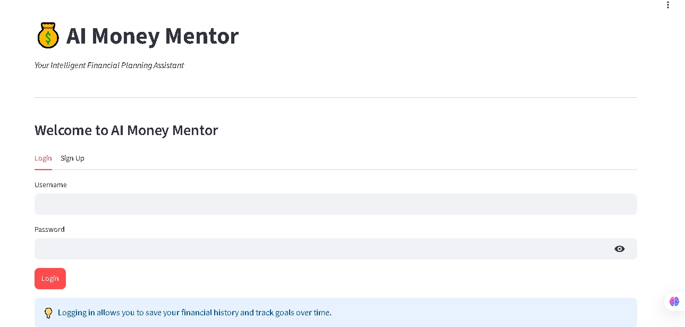
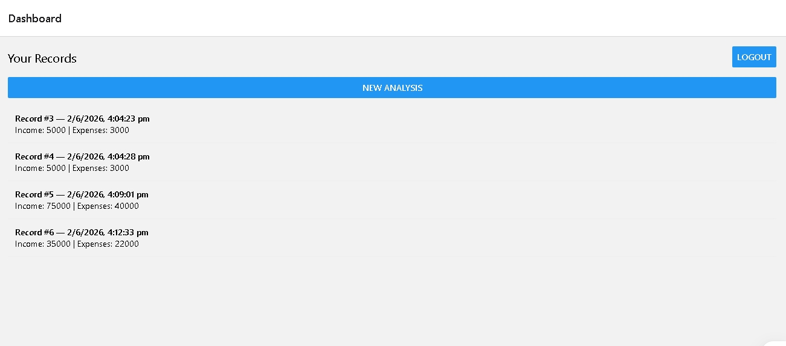
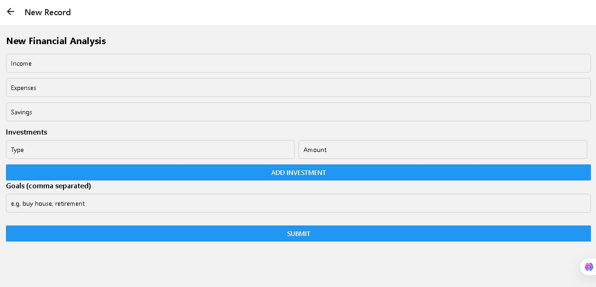
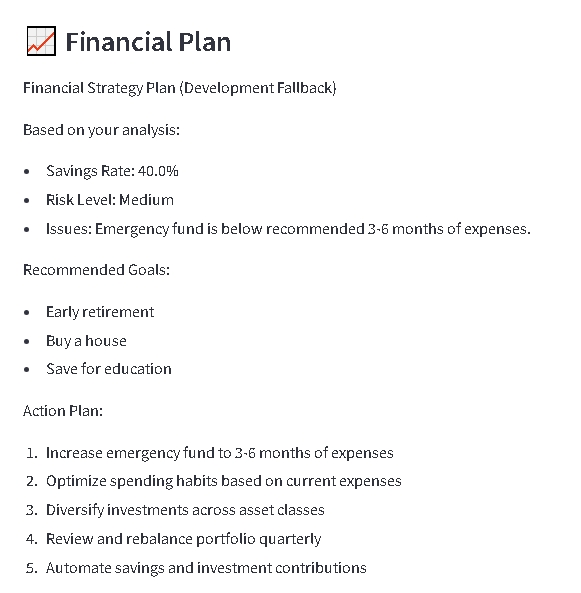
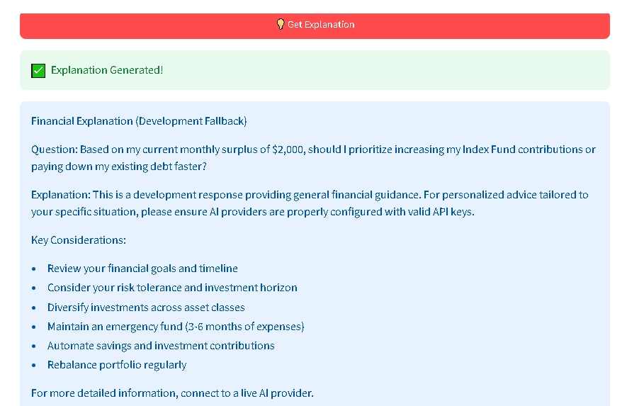
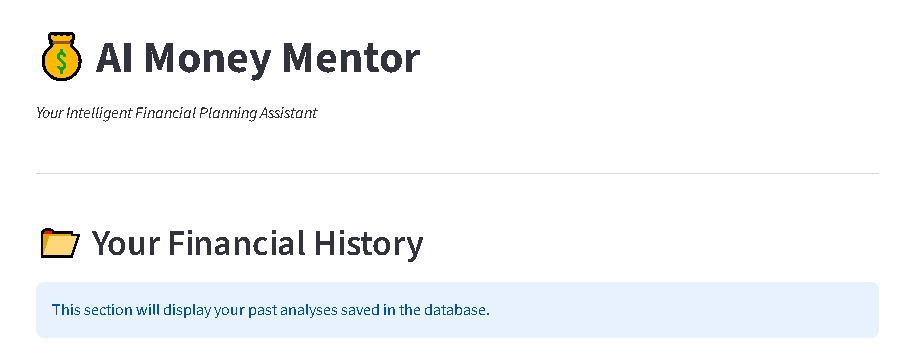
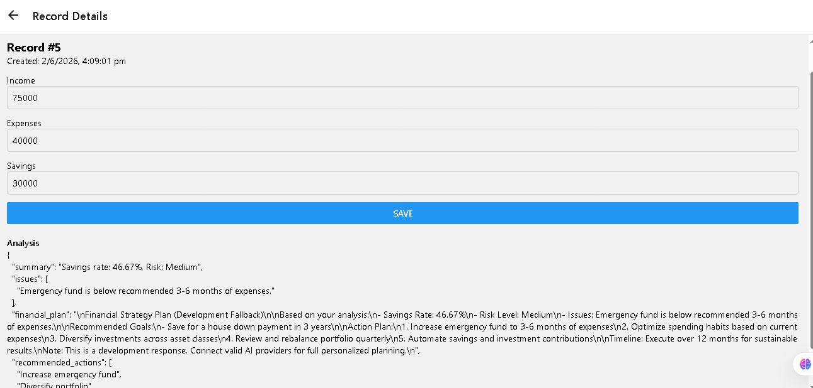

# 💰 AI Money Mentor – Agentic Financial Intelligence System

AI Money Mentor is a **multi-agent AI-powered financial intelligence platform** that helps users analyze finances, generate personalized financial plans, understand recommendations through explainable AI, and maintain financial history for better decision-making.

The project combines **FastAPI, LangGraph, AI orchestration, React Native (Expo), and intelligent financial analysis** to provide a complete financial planning experience.

---

## 🚀 Features

### 🤖 Multi-Agent AI Architecture

* Multi-agent orchestration using **LangGraph**
* Specialized agents for:

  * Financial analysis
  * Planning and recommendation
  * Explanation generation
  * Memory management

### 💰 Personalized Financial Planning

* Income, expenses, savings, and investment analysis
* Risk-level assessment
* Personalized financial recommendations
* Goal-based financial planning

### 🧠 Explainable AI

* AI-generated recommendations with explanations
* Transparency in decision-making
* Financial reasoning based on user data

### 📊 Financial Dashboard

* Overview of financial health
* Savings insights
* Risk evaluation
* Personalized action items

### 📝 Financial Records & History

* Save financial analyses
* Track historical financial records
* View detailed financial reports
* Access previous recommendations

### 📱 Mobile Application

* Cross-platform mobile app using **React Native + Expo**
* Clean financial dashboard
* New financial record creation
* History tracking
* Detailed report visualization

### 🔄 Multi-Provider AI Support

Supports multiple AI providers:

* OpenAI
* Groq
* Hugging Face

Automatic fallback and provider flexibility for reliability.

### 📜 Logging & Audit Trail

* Request logging
* Financial analysis history
* Debugging support
* Traceable AI workflow

### 🐳 Deployment Ready

* Docker support
* Docker Compose setup
* API-first architecture
* Mobile integration ready

---

## 🏗️ Tech Stack

### Backend

* Python
* FastAPI
* LangGraph
* Pydantic
* Uvicorn

### AI & LLM

* OpenAI
* Groq
* Hugging Face

### Frontend / Mobile

* React Native
* Expo

### Database / Storage

* JSON / Memory-based persistence

### DevOps

* Docker
* Docker Compose

---

## 📸 Application Screenshots

### Landing Page



### Dashboard



### Create New Financial Record



### Financial Plan



### Financial Explanation



### Financial History



### Record Details



---

## 📂 Project Structure

```txt
AI_Money_Mentor/
│
├── agents/                 # AI agents for financial reasoning
├── services/               # AI providers, memory, logging
├── routes/                 # FastAPI API routes
├── models/                 # Pydantic request/response schemas
├── mobile_app/             # React Native Expo application
├── screenshots/            # Application screenshots
├── logs/                   # Application logs
├── main.py                 # FastAPI backend entry point
├── app.py                  # Streamlit frontend (optional)
├── requirements.txt        # Python dependencies
├── Dockerfile              # Docker image
├── docker-compose.yml      # Docker compose setup
├── .env                    # Environment variables
└── README.md               # Project documentation
```

---

## ⚙️ Installation & Setup

### 1. Clone Repository

```bash
git clone <https://github.com/Harish13052005/AI_Money_Mentor>
cd AI_Money_Mentor
```

---

### 2. Create Virtual Environment

```bash
python -m venv .venv
```

Activate environment:

#### Windows

```bash
.venv\Scripts\activate
```

#### Linux / Mac

```bash
source .venv/bin/activate
```

---

### 3. Install Dependencies

```bash
pip install -r requirements.txt
```

---

### 4. Configure Environment Variables

Create a `.env` file in the project root:

```env
OPENAI_API_KEY=your_openai_api_key
GROQ_API_KEY=your_groq_api_key
HUGGINGFACE_API_KEY=your_huggingface_api_key
```

---

## ▶️ Running the Backend

Start FastAPI server:

```bash
python main.py
```

or

```bash
uvicorn main:app --host 0.0.0.0 --port 8000 --reload
```

API Docs:

```txt
http://localhost:8000/docs
```

For physical mobile device testing:

```txt
http://YOUR_LOCAL_IP:8000
```

Example:

```txt
http://192.168.0.108:8000
```

---

## 📱 Running the Mobile App (Expo)

Move to mobile app:

```bash
cd mobile_app
```

Install dependencies:

```bash
npm install
```

Start Expo:

```bash
npm start
```

Update API base URL in:

```txt
mobile_app/services/api.js
```

Set:

### Android Emulator

```txt
http://10.0.2.2:8000
```

### iOS Simulator

```txt
http://localhost:8000
```

### Physical Device

```txt
http://YOUR_MACHINE_IP:8000
```

Example:

```txt
http://192.168.0.108:8000
```

---

## 🔌 API Endpoints

### Analyze Financial Data

**POST** `/analyze`

Sample Input:

```json
{
  "income": 5000,
  "expenses": 3000,
  "savings": 1000,
  "investments": [
    {
      "type": "stocks",
      "amount": 2000
    },
    {
      "type": "mutual_funds",
      "amount": 1000
    }
  ],
  "goals": [
    "buy house",
    "retirement"
  ]
}
```

---

### Get Financial Explanation

**POST** `/explain`

Returns explainable insights for generated financial plans.

---

## 🧪 Running Tests

```bash
pytest
```

---

## 🐳 Docker Deployment

### Using Docker Compose

```bash
docker-compose up --build
```

### Manual Docker Setup

Build image:

```bash
docker build -t ai-money-mentor .
```

Run container:

```bash
docker run -p 8000:8000 --env-file .env ai-money-mentor
```

---

## 🎯 Future Improvements

* User authentication
* Cloud database integration
* Real-time expense tracking
* Advanced investment recommendations
* Budget forecasting
* AI chat-based financial assistant

---

## 👨‍💻 Author

**Harish Kumar**
Computer Science Engineer | Full Stack & AI Enthusiast

If you found this project useful, consider giving it a ⭐ on GitHub.
